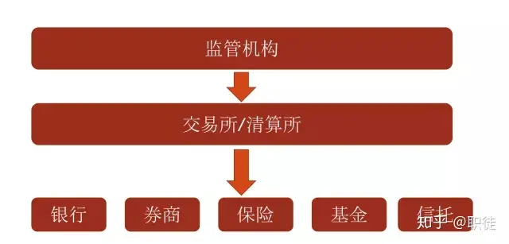
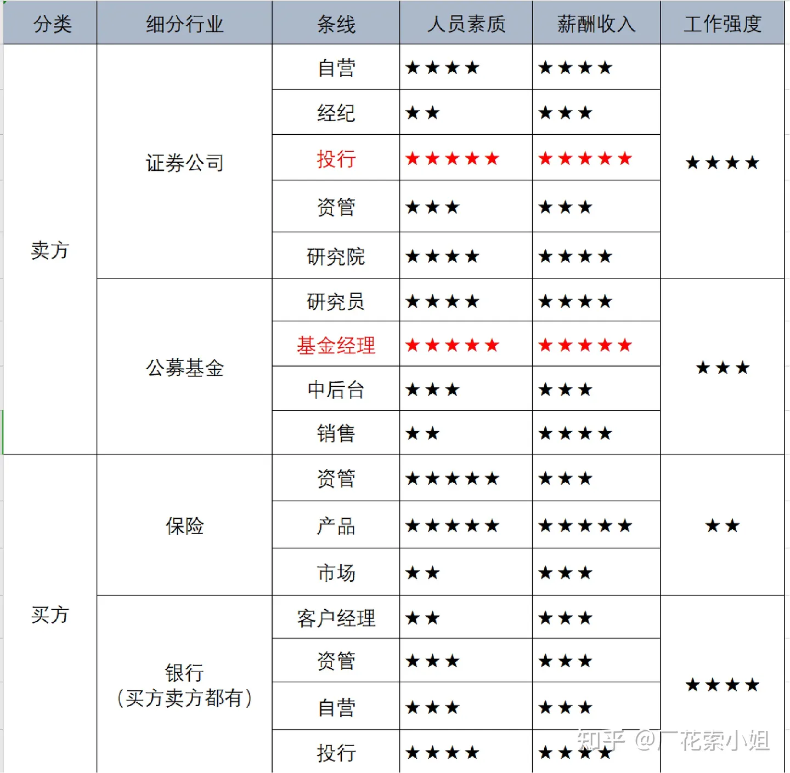
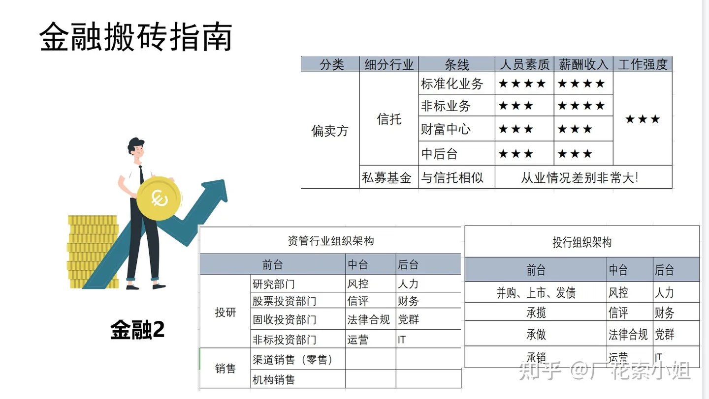

### 金融机构生态

{ width="500" }

### 分类

#### 监管机构

证监会、银监会、保监会、央行

证券业协会---行业的自律组织

#### 银行

- 商业银行（例如：汇丰银行、招商银行）
- 投资银行（例如：高盛、UBS）

#### 交易所/清算所

两大股票交易所：
- 上海证券交易所
- 深圳证券交易所

四大期货交易所
- 上海期货交易所 -- 贵金属和有色金属
- 郑州期货交易所 -- 农产品
- 大连期货交易所 -- 工业品
- 中国金融期货交易所 -- 股指期货

上海黄金交易所 -- 黄金现货交易

{ width="500" }
{ width="500" }

#### 买方（Buy-side）

买方实体通常是指那些 **为了自身资产管理目的而购买证券和其他投资品的机构** 。买方的主要任务是增加投资组合的价值，为其客户（可能是个人投资者、退休基金、保险公司等）产生回报。

##### 买方机构包括

- 投资基金（包括公募基金和私募基金）：

	- 共同基金：为广大投资者提供多样化投资机会，通常每日计算并公开净资产值
	- 对冲基金：采用多种策略投资各种资产，寻求超越市场平均收益率的回报 （例如：Citadel、九坤）
	- 指数基金和交易所交易基金（ETFs）：通常跟踪特定的市场指数

- 养老基金：包括公共和私人退休基金，管理职员的退休资金，通过投资股票、债券和其他资产以保值增值
- 保险公司：通过其资管部门投资保费收入，以确保能够支付未来的索赔，并寻求资本增值
- 私募股权：投资未上市公司的股权，通常寻求通过公司成长或重组获取收益
- 风险投资基金：专注于初创和成长阶段的企业，提供资金支持以换取股权
- 财富管理公司/信托公司：为高净值个人和家庭提供资产管理服务，包括投资咨询和财务规划
- 家族办公室：管理单个家族的财富，包括投资、遗产规划和其他财务服务
- 管理捐赠资金，通过投资收益支持教育和慈善活动

买方分析师通常关注长期投资回报，因此他们的研究可能更加深入，更加专注于基本面分析。

#### 卖方（Sell-side）

卖方实体主要是那些 **为买方机构提供服务和产品的机构** 。他们的主要角色是促成交易，提供市场流动性和研究服务。卖方机构通常包括：

- 投资银行：

	- 提供证券发行（IPOs）、并购咨询（M&A）、资本增长策略和其他金融服务
	- 在资本市场中起着桥梁作用，帮助公司融资并为投资者提供投资机会

- 经纪公司：

	- 执行买卖证券的订单，如股票、债券和其他金融工具
	- 提供市场研究、投资建议和财务咨询服务

- 市场制造商：
	- 在证券交易所提供买卖报价，确保市场的流动性和效率
	- 通过买卖价差赚取利润，同时承担市场波动的风险

- 分析和研究机构：

	- 提供详尽的市场、行业和公司分析报告
	- 协助投资者通过提供数据和预测来做出更好的投资决策

- 咨询公司：

	- 在金融战略、企业管理和技术解决方案方面提供专家意见和服务
	- 协助企业和机构优化结构，提高运营效率和财务表现

- 交易所和清算机构：

	- 管理和维护交易平台，保证交易的执行和结算。
	- 虽然这些机构不直接介入买卖决策，但它们提供交易所需的基础设施和服务

卖方机构通常以服务提供者的形式存在，他们通过各种金融服务和交易支持来促进市场的有效运作。通过这些服务，卖方机构帮助买方机构更好地进行资产配置和投资决策。

**证券公司 ，或称为经纪商-交易商，既提供经纪服务也可能自行交易:/投行**

- 经纪服务：

	- 证券公司作为经纪人为客户执行买入和卖出证券的订单。这包括为个人投资者和机构客户如基金和其他金融机构服务。
	- 提供客户账户管理、交易执行、资金和证券清算等服务。

- 交易服务：

	- 证券公司作为交易商可能会自己持有证券库存，并通过市场制造商的角色参与市场，以提供买卖证券的流动性。
	- 在执行买卖操作时，他们可能自行承担一部分风险。

- 研究和顾问服务：
	- 提供市场研究、投资策略和行业分析，帮助客户做出投资决策。
	- 研究部门经常发布关于股票、债券、行业和经济的详细报告。

#### 其他参与者

金融市场的其他参与者可能包括：

- **中央银行和政府机构**：通过政策制定和市场干预来影响金融市场。
- **评级机构**：评估债务工具的信用风险，影响债务定价和投资决策。
- **顾问和独立研究机构**：提供专门的咨询和研究服务，可能不直接参与交易。
