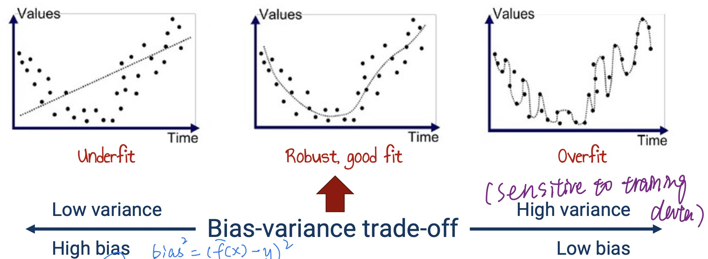

## Bias-variance trade-off

{ width="600" }

Bias:

- 模型对训练集的拟合程度
- $Bias^{2} = (y -y_{pre})^2$  ---- 训练集所训练的模型对于训练集数据的输出和真实值之间的差异
- 越高 -> 当前模型不能在当前数据集上有好的效果

Variance:

- 数据扰动对模型的影响
- 表示不同的训练集训练出的模型的输出值之间的差异
- 越高 -> 当前模型不能在其他数据集上有好的效果；越低 -> 对数据的你拟合效果好

Underfit & Overfit：

- Underfit: low variance/high bias 
- Overfit: high variance/low bias

