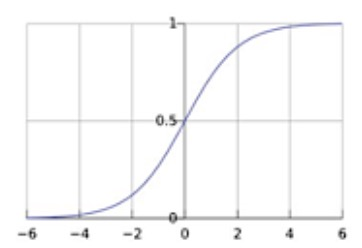
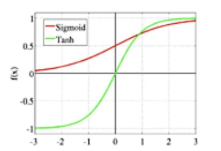
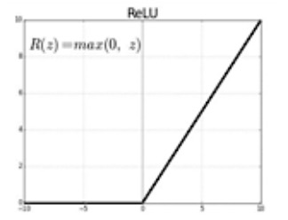

## 定义

## 常见激活函数

### Linear

不使用任何激活函数，直接将结果通过线性层

### Sigmoid

$$f(x) = \sigma{x} = \frac{1}{1+e^{-x}}$$ 

值域：$[0,1]$

图像:
{ width="300" }

### Tanh

$$f(x) = Tanh(x) = \frac{e^{x}-e^{-x}}{e^{x}+e^{-x}}$$

图像:
{ width="300" }

值域：$[-1,1]$

### ReLU

$$f(x)=ReLU(x)$$

值域：$[0,+]$

图像:
{ width="300" }

### Softmax

$$f(x)=Softmax(z_{i}) = \frac{e^{z_{i}}{\sum^{K}e^{z_{i}}$$

## 激活函数的常见应用

- 二分类：sigmoid or tanh(输出结果有边界)
- 预测无边界的值：linear
- 预测概率分布：softmax
- ReLU：要求结果是无边界的正值

