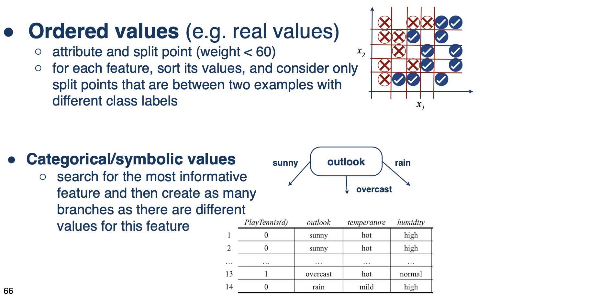
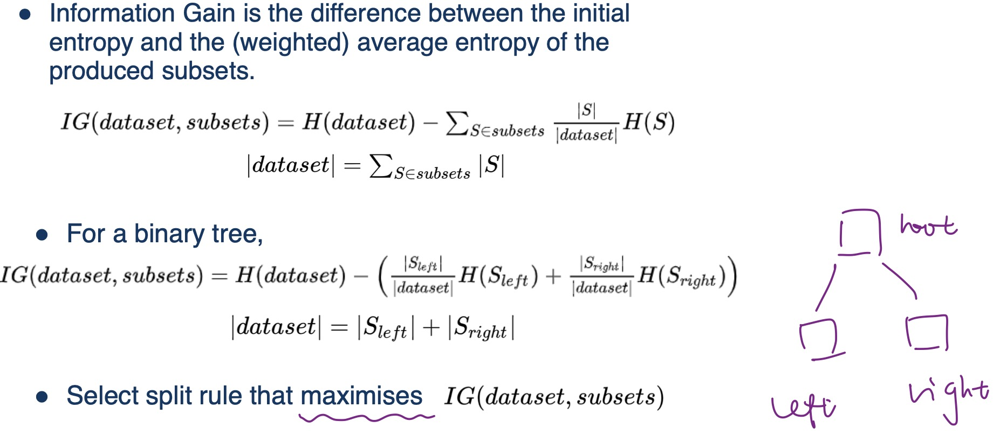

## Introduction

- 决策树学习（或构造/归纳）是一种通过基于树的表示来近似离散分类函数的方法
- 决策树可以表示为一组 if-then 规则
- 决策树学习算法采用自上而下的贪婪搜索来搜索可能的解决方案空间

## Information Entropy/Information Gain

- 熵是随机变量不确定性的度量
- 也可以看作是到达完全定义随机状态（或变量）所需的平均/预期信息量

=> 熵被定义为信息的平均量：$H(X)=-\sum^{K}_{k}P(x_{k})log_{2}(P(x_{k}))$

Continuous Entropy:

对于概率密度函数 f(x)，我们可以定义连续熵，类似于 Shanon 的定义：$H(X)=-\int_{x}{f(x)log_{2}(f(x))}$

## Algorithm

### 常规算法

1. 在训练数据上寻找“最佳”分割规则
2. 根据选择的分割规则分割数据集
3. 在每个新的分割子集上重复 1. 和 2.

分割规则：信息熵，基尼不纯度，方差减少

### 使用信息熵进行分割算法

不同的输入：

{ width="700" }

详细步骤：

{ width="700" }

## Decision Trees: Overfitting

方法：

- Early stopping
- Pruning

	1. 遍历每个仅连接到叶节点的内部节点。
	2. 将每个节点变成叶节点（具有多数类标签）。
	3. 在验证集上评估修剪后的树。如果准确度高于未修剪的准确度，则进行修剪。
	4. 重复，直到所有此类节点都经过测试

## Random forests

- 许多决策树对类别标签进行投票
- 每棵树都使用训练集的随机样本和特征的随机子集生成

## Regression trees

- 每个叶节点现在预测一个实数，而不是类标签
	- 使用叶节点的训练示例来估计输出值（例如，最小化最小平方误差的值）或学习某些数值特征子集的线性函数

- 使用不同的度量进行拆分(分割)
	- 方差减少