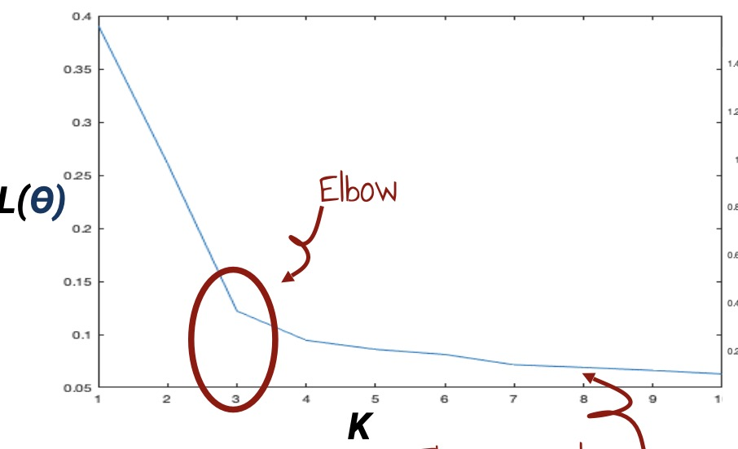

## 定义

## 算法

## 怎么选择K

### elbow method

算法：

- 使用不同的K运行K-means算法
- 记录使用不同的K运行时L(Ө)的值
- 选择导致图像斜率变化最大时的K值

例子：

{ width="600" }

### cross-validation method

算法：

- The dataset is split in N folds, and N-1 folds are used to compute the centroids positions with k-means. 
- Then, we compute the average score (same as before) on the validation datasets. 
- We do this for various values of k and we pick the best configuration.

## 优点和缺点

### 优点

- Simple
    - Easy to understand and implement
- Popular
    - Used very often for clustering
- Efficient
    - Linear complexity
    - O(TKN) for T iterations, K clusters, N examples. Since K << N and T << N, k-means is considered a linear
algorithm.

### 缺点

- We have to define k
- K-means finds a local optimum
- It is sensitive to the initial centroid positions
- K-means is only applicable if a distance function exists.
    - A variant exist for categorical data: k-mode, the centroids represent the most frequent values.
- K-means is sensitive to outliers
- K-means is not suitable for discovering clusters that are not hyper-ellipsoids (or hyper-spheres).