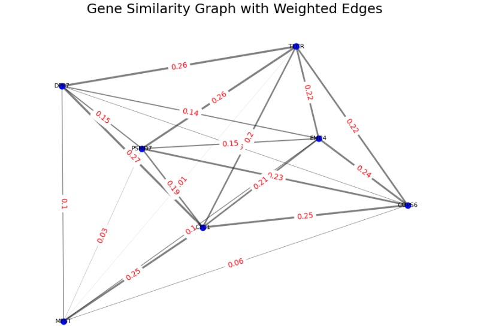

## 创建网络图

### 建立数据
```py
# Compute cosine similarities among genes in this gene program
df_CD = pd.DataFrame(columns=['Gene', 'Similarity', 'Gene1'])

# 遍历CD_genes列表中的每个基因
for i in CD_genes:
    df = embed.compute_similarities(i, CD_genes)
    df['Gene1'] = i
    df_CD = pd.concat([df_CD, df], ignore_index=True)

print(df_CD)

'''
对 df_CD 中的数据进行筛选，只保留相似度小于 0.99 的那些行。
这样的筛选通常用来移除相似度极高（几乎相同）的基因对，
这些高相似度的数据可能不适合用于进一步分析，因为它们可能表示了相同或非常近似的基因
'''
df_CD_sub = df_CD[df_CD['Similarity']<0.99].sort_values(by='Gene')

```

### 绘制图表

```py
# 创建了一个加权图（网络），用于表示基因之间的相似度关系
input_node_weights = [(row['Gene'], row['Gene1'], round(row['Similarity'], 2)) for i, row in df_CD_sub.iterrows()]
G = nx.Graph()
G.add_weighted_edges_from(input_node_weights)
```

```py
import matplotlib.pyplot as plt
import networkx as nx

# 创建图形和轴对象
fig, ax = plt.subplots(figsize=(10, 8))

# 设置图形的布局，spring_layout 会尝试将边权重较大的节点放得更近一些
pos = nx.spring_layout(G, weight='weight')

# 获取边的权重，用于调整边的显示样式
weights = [G[u][v]['weight']*10 for u,v in G.edges()]  # 放大权重以便于可视化

# 创建边标签字典
edge_labels = {(u, v): f"{d['weight']}" for u, v, d in G.edges(data=True)}

# 绘制网络图，其中节点的位置由spring布局决定，边的宽度与权重成比例
pos = nx.spring_layout(G)  # 使用spring布局
nx.draw_networkx_nodes(G, pos, node_color='blue', node_size=50, ax=ax)
nx.draw_networkx_edges(G, pos, width=weights, alpha=0.5, ax=ax)
nx.draw_networkx_labels(G, pos, font_size=8, font_family='sans-serif', ax=ax)
nx.draw_networkx_edge_labels(G, pos, edge_labels=edge_labels, font_color='red')

plt.title("Gene Similarity Graph with Weighted Edges")
plt.axis('off')  # 关闭坐标轴
plt.show()
```
### 示例图释

{ width="900" }