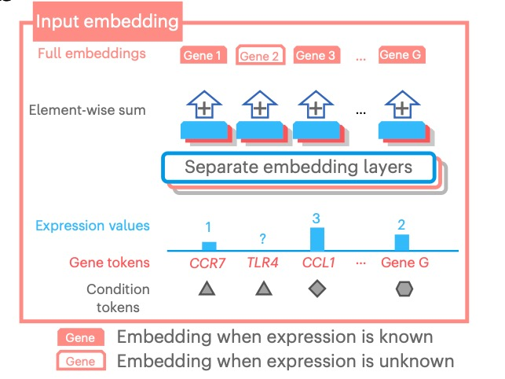

## scGPT的结构
{ width="900" }

这个图示描述了 scGPT（单细胞基因表达转换模型）的结构和工作流程.

### 图a: 预训练和微调
**预训练阶段(Pretraining)**：
{ width="600" }

   - **目标**：利用大型细胞图谱数据对 scGPT 进行初步训练，以学习细胞和基因的一般性表示。
   - **方法**：使用掩码注意力变换器(a specially designed attention mask)和生成训练技术(generative training pipeline)。这种方法允许模型通过自监督学习( self-supervised)来优化细胞和基因的表示 (optimize cell and gene representations)，即模型学习预测缺失的基因表达数据。

   	- **详细方法**：针对基因表达数据的非序列性质进行处理，使其适应于自然语言生成（NLG）框架中的序列预测 [详细解释](../scGPT-%E5%9F%BA%E5%9B%A0%E8%A1%A8%E8%BE%BE%E9%80%82%E5%BA%94%E5%BA%8F%E5%88%97%E5%8C%96%E9%A2%84%E6%B5%8B/)

   - **输出**：模型在这一阶段能够基于细胞状态(cell states)或基因表达提示(gene expression cues)来生成细胞的基因表达(gene expression of cells).

**微调阶段(Fine-tuning)**：
{ width="600" }

   - **目标**：将预训练的模型适应新的、更小的数据集和具体的生物学任务(e.g., single-cell research, including scRNA-seq integration with batch correction, cell type annotation, multi-omic integration, perturbation prediction and gene regulatory network (GRN) inference.)。
   - **过程**：在新数据集上继续训练模型，调整模型权重以更好地反映特定数据集的特征和任务要求。

### 图b: 输入嵌入和模型架构

{ width="400" }

- **输入嵌入**：展示了如何处理不同类型的基因表达数据（已知表达和未知表达）。不同的嵌入层用于不同类型的数据，以优化模型的输入处理。
- **结构**：图示显示了多层注意力机制如何被用来处理嵌入后的输入，通过连续的注意力和前馈层逐步构建最终输出。

### 图c: 掩码注意力变换器
{ width="400" }

- **详细架构**：描绘了注意力模型的内部工作，包括掩码多头注意力、归一化和前馈层。这种结构帮助模型在接收到部分信息（如部分基因表达数据）的情况下预测缺失数据。

