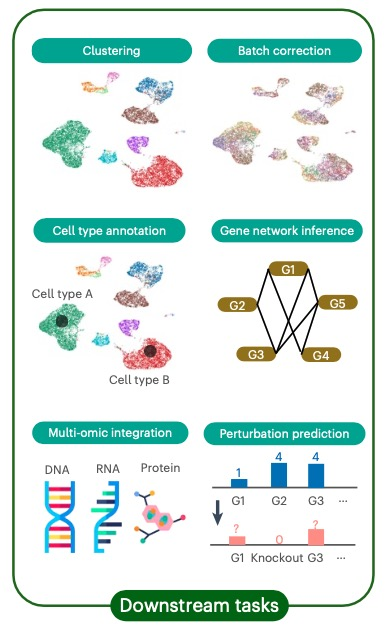

- 细胞类型注释（Cell type annotation）：

这是指通过分析单细胞测序数据，识别和标记不同细胞的类型或状态的过程。细胞类型的注释帮助研究者理解组织中细胞的多样性和功能。

- 多批次整合（Multi-batch integration）：

在单细胞研究中，由于技术或实验条件的不同，相同条件下的实验可能会产生批次效应。多批次整合是指使用统计或计算方法合并来自不同批次的数据，以消除批次间的差异，确保数据的一致性和可比性。

- 多组学整合（Multi-omic integration）：

在现代生物学研究中，研究者可能会从同一样本中收集多种类型的分子数据，如基因组、转录组、蛋白质组等。多组学整合指的是整合这些不同层面的数据，以获得对生物系统更全面的理解。

- 干扰响应预测（Perturbation response prediction）：

这涉及预测细胞或生物系统在受到外部干扰（如药物处理、基因敲除等）后的反应。这种预测有助于理解生物路径的作用机制，也是药物开发中的重要环节。

- 基因网络推断（Gene network inference）：

这是指基于统计和计算方法推断基因之间相互作用的网络。通过研究基因如何通过网络互相调控，科学家可以揭示基因表达的调控机制和生物过程。

{ width="350" }

