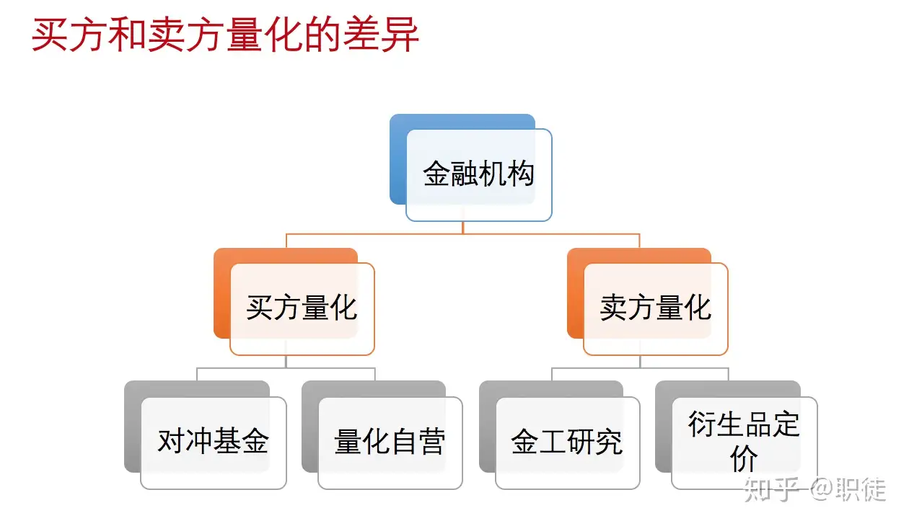
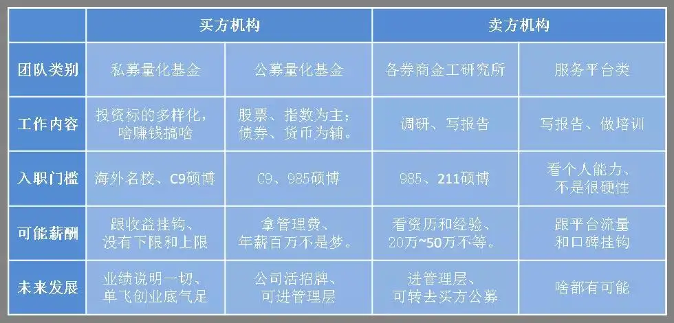

### 工作分类

在量化金融领域，根据专业技能和工作性质的不同，可以分为以下三种主要岗位：

**Quantitative Analyst (量化分析师)**：

   - 量化分析师主要 **负责策略的研究和开发** 。他们使用数学模型和统计方法来分析市场数据，发掘投资机会。
   - 量化分析师的工作可以进一步细分为 **策略研究员和基金经理**。策略研究员专注于开发和测试投资策略，而基金经理则可能使用这些策略来管理投资组合和执行交易。
   - 这类岗位需要深厚的数学、统计学和金融理论知识，同时也需要能够使用编程语言如Python或R来实现和测试模型。

**Quantitative Developer (量化开发员)**：

   - 量化开发员的角色是 **实现量化分析师和基金经理设计的策略和模型** ，确保这些策略在实际交易中的有效性和效率。
   - 工作包括编写高性能的代码来执行复杂的交易算法，管理和优化交易平台的性能。
   - 量化开发者需要具备强大的编程技能，通常涉及C++, Python或Java等语言，同时需要了解金融市场的运作和交易系统的技术细节。

**IT Developer (信息技术开发员)**：

   - IT开发员在量化金融中主要 **负责开发和维护交易系统的基础架构** ，这包括数据管理、系统安全和网络通讯等方面。
   - 他们的工作重点在于确保交易平台的稳定性和安全性，提升系统的处理速度和数据传输效率。
   - 该岗位通常需要深入了解计算机科学和信息技术，同时具备一定的金融知识也是非常有帮助的。

## 工作机会

### 监管机构&交易所/清算所

### 银行

- 金融市场部：相当于券商的自营部门，用自己的钱做投资交易
- 资产管理部：与券商资管类似，代客理财

### 券商/证券公司

{ width="500" }

- 买方量化 ：自营业务和资产管理自营业务，券商自营业务涉及范围非常广泛，如做市、场外衍生品等资产管理等；
- 卖方量化 ：研究所，主要包括金工研究和衍生品定价，产出分析报告，为自营部门和资管部门服务。

{ width="800" }

### 买方量化工作机会

- 公募基金：向公众开放的投资基金，允许个人和机构投资者购买份额

	- 投资经理主要做投资决策，买哪些股票
	- **研究员提供买卖建议**
	- 交易员主要执行投资经理的指令

- 私募基金：仅向有限数量的认可投资者或高净值个人提供的投资基金，不对普通公众开放
- 证券公司资管部（证券买方）、证券公司自营部（也是证券买方）、衍生品部（期权方向）
- 信托公司旗下量化团队
- 保险资管公司
- 大型资管公司旗下也有量化团队

### 卖方量化工作机会

### 其他
- 期货公司以及期货风险子公司
- 金融科技公司的量化机会
- 国内银行机构与外资银行
- 量化平台科技机构与量化交易系统平台公司
- 金融数据上市公司等
- 数字货币 cryptocurrency 量化研究与投资机构

