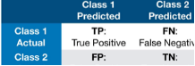

{ width="500" }

Take Class 1 as the example:

$Accuracy =\frac{TP+TN}{TP+TN+FP+FN}$

$Precision = \frac{TP}{TP+FP}$

$Recall= \frac{TP}{TP+FN}$   

F1 = $\frac{2*precision*recall}{precision+recall}=\frac{TP}{TP+1/2(FP+FN)}$

Macro-averaged F1: average of each class F1 scores(评估平均性能/imbalancd data)
Micro-averaged F1: TPs, TNs, FNs, FPs are summed across each class(关心整体性能)  
Micro-averaged F1 = $\frac{∑_{i}^{C}TP_{i}}{|Dataset|}$ = Accuracy   

## Language Model

$P(w│h)=P(w_{n}|w_1^{n-1})$

$Bigram: P(w_{n}│w_{n-1})=\frac{C(w_{n-1}w_{n})}{C(w_{n-1})}$

$Trigram: P(w_{n}│w_{n-2}w_{n-1})=\frac{C(w_{n-2}w_{n-1}w_{n})}{C(w_{n-2}w_{n-1})}$

$N-gram: P(w_{n}│w^{n-1}_{n-N+1})=\frac{C(w^{n-1}_{n-N+1}w_{n})}{C(w^{n-1}_{n-N+1})}$

$Unigram$: 每个词独立,不依赖其他词

Evaluate a sequence: $P(w_1,w_2….w_n)=P(w_1)P(w_2 |w_1)P(w_3 |w_2 w_1)…P(w_n│w_{1}^{n-1})=∏_{k=1}^{n}(P(w_k |w_1^{k-1})$
goal: min PPL

**Perplexity(PPL)**: 

$$ PPL=P(w_1, w_2, \ldots, w_n)^{-\frac{1}{n}} = \sqrt[n]{\frac{1}{\prod_{k=1}^{n} P(w_k | w_1^{k-1})}}$$

For Bigram, 

$$PPL=\sqrt[n]{\frac{1}{\prod_{k=1}^{n} P(w_k | w_{k-1})}}$$

## Evaluating LLMs

- Extrinsic evaluation: 直接反映模型在实际应用中的表现. 
- Intrinsic evaluation: PPL

**Sparsity:** 语料库中, 有词汇组合未出现过,计算时概率为0, PPL计算会出问题

-  Add-one smoothing

$$e.g., Bigram: P(w_{n}│w_{n-1})=\frac{C(w_{n-1}w_{n})+1}{C(w_{n-1})+|V|}$$

-  Back off smoothing: 当长n-gram在语料库中未出现时,退到更短的n-gram
-  Interpolation

e.g.,  $P_{Inter} (w_i│w_{i-2} w_{i-1} )=λ_1 P(w_i│w_{i-2} w_{i-1} )+λ_2 P(w_i│w_{i-1} )+λ_3 P(w_i)$
