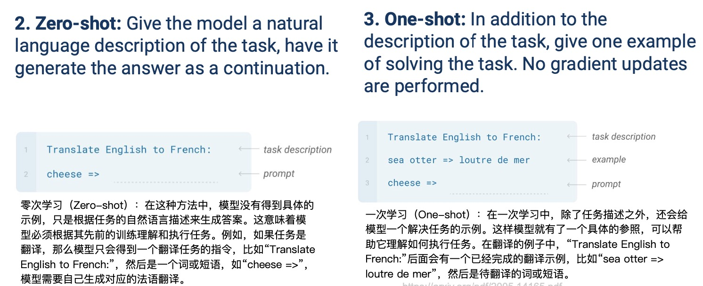
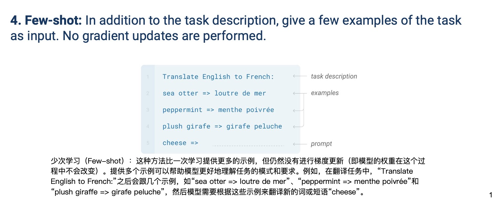

### Fine-tuning

- A. Supervised training for particular input-output pairs.
- Put a new layer on top and fine-tune the model for a desired task.

### shot setting

模型不通过反向传播或任何形式的训练来更新其参数。相反，它们依赖于模型的先验知识和给定的少量示例来推断出正确的输出。这些方法在少数据或零数据学习环境中特别有用，可以用来评估模型对新任务的泛化能力。

#### Zero-shot and one-shot
{ width="800" }

- Zero-shot: Give the model a natural language description of the task, let it generate the answer. 
- One-shot: In addition to the description of the task, give one example of solving the task (No gradient updates).

#### Few-shot
{ width="800" }

- Few-shot: In addition to the task description, give a few examples of the task as input(No gradient updates).