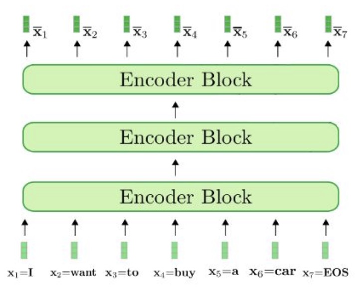
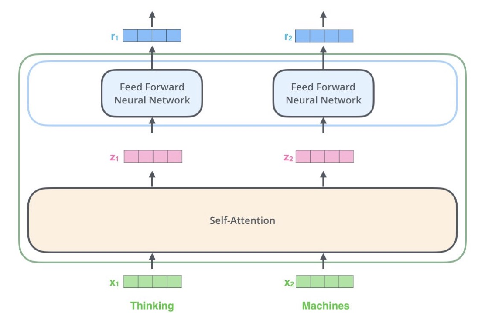
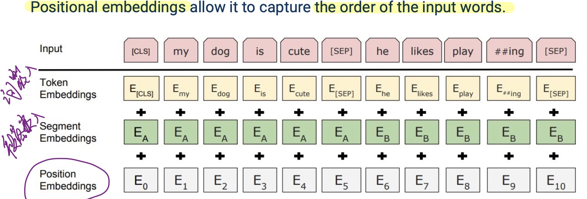
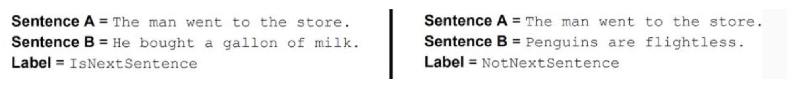
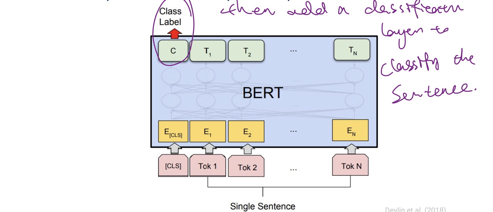
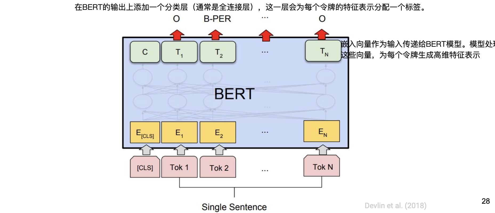
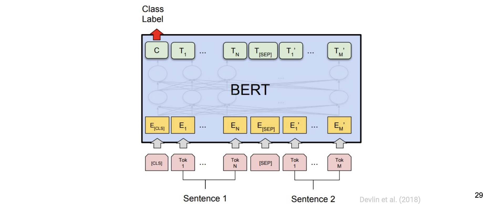
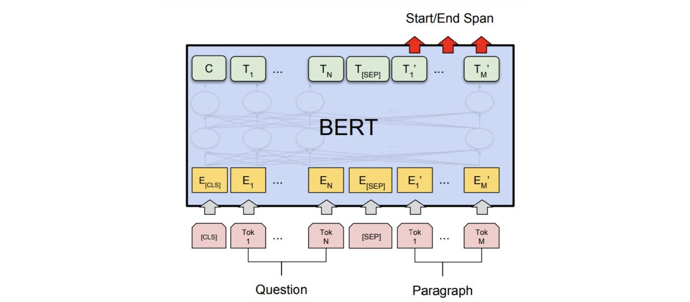

- Bidirectional Encoder Representations from Transformers
- Takes in a sequence of tokens, gives as output a vector for each token.

## Architecture
{ width="600" }

**(transformer) encoder:**

{ width="600" }

- Input embeddings
{ width="600" }

- Self-attention/Multi-head self-attention

## Pre-training Tasks

### Masked Language Modeling

- Use masked language modeling as the training task - it requires no labeled data
    - Hide k% of the input words behind a mask, train the model to predict them. 

训练数据中大约15%(k = 15%)的单词会被随机掩盖:

- 80%保持[MASK]:为了让模型学习在存在掩码时预测原词;
e.g., went to the store -> went to the [MASK]
- 10%替换为随机词:训练模型以在输入中处理噪音,即使替换的词不是正确的词,模型也要学会从上下文中找线索.学习构建所有词汇的良好表示,避免模型过度专注于只处理[MASK]标记,而忽略了对非掩码词的表示学习;
e.g., went to the store -> went to the running
- 10%替换为原词: 防止模型过分依赖于[MASK]标记.如果模型仅在看到[MASK]标记时尝试预测词汇,可能倾向于怀疑所有非[MASK]词汇的正确性,从而降低模型对真实,未经掩码的输入数据的处理能力,通过偶尔让模型在知道正确答案的情况下进行预测,可以鼓励模型学习如何更好地利用上下文信息. 
e.g., went to the store -> went to the store

### Next sentence prediction

Given two sentences, predict whether they appeared in the original order in the source text.

{ width="800" }

## BERT details

Two model variants:

- BERT-base
    - 12 layers
    - 768-dimensional hidden states
    - 12 attention heads
    - 110 million parameters

- BERT-large
    - 24 layers
    - 1024-dimensional hidden states
    - 16 attention heads
    - 340 million parameters

Trained on:

- BooksCorpus (800 million words)
- English Wikipedia (2,500 million words)

## Downsteam task

- BERT-like models give us a representation vector for every input token.
- We can use those vectors to represent individual tokens or full sentences.

### Methods

- Freeze BERT, use it to calculate informative representation vectors. Train another ML model that uses these vectors as input.
- Put a minimal neural architecture on top of BERT (e.g. a single output layer) Train the whole thing end-to-end (called fine-tuning).

### Tesks

#### Sentence classification
add a special toσken in the input that represents the whole sentence

{ width="800" }

#### Token labeling
Putting a classification layer on top of token vectors

{ width="800" }

#### Sentence pair classification
Giving multiple sentences as input

{ width="800" }

#### Question answering

Labeling the tokens in the candidate answer span

{ width="800" }

