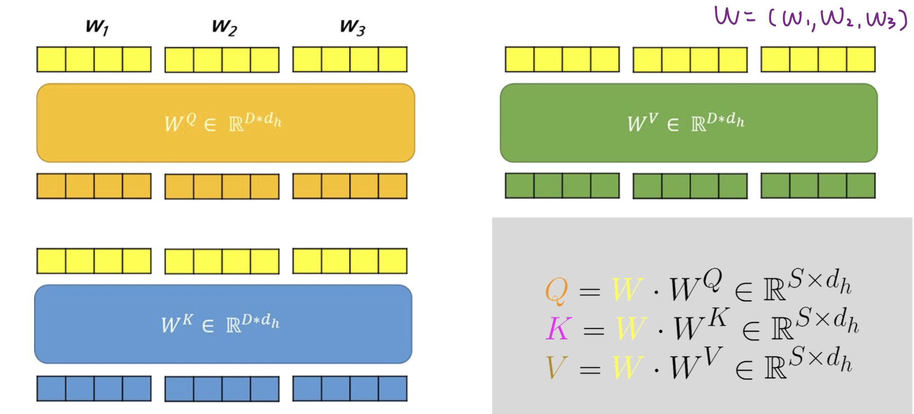
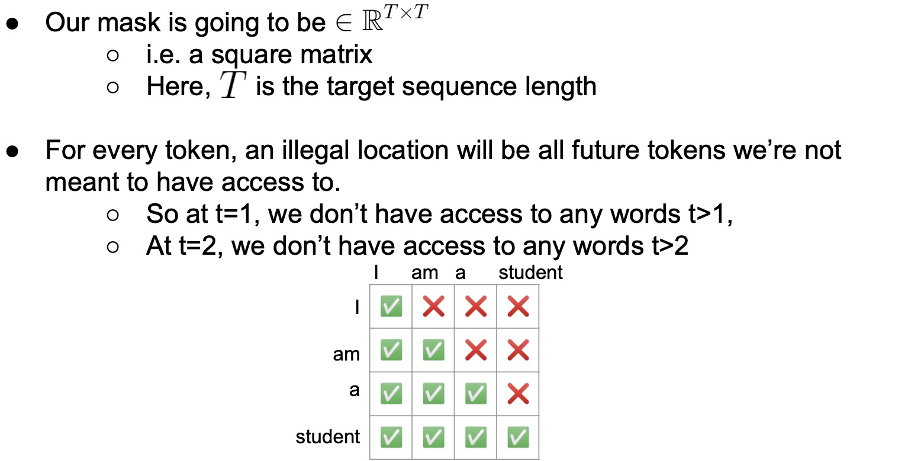
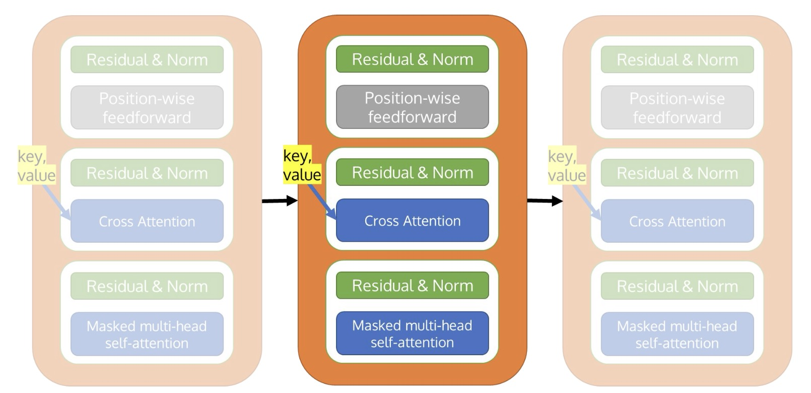
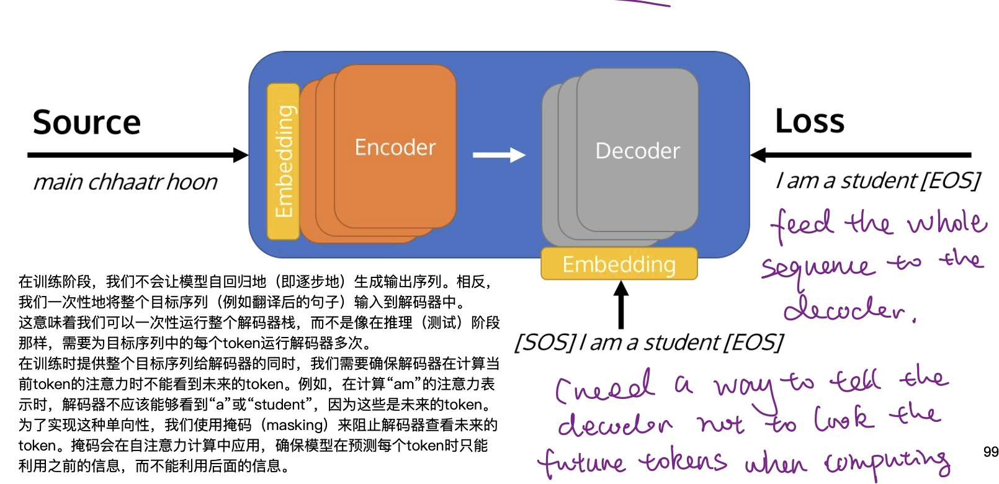
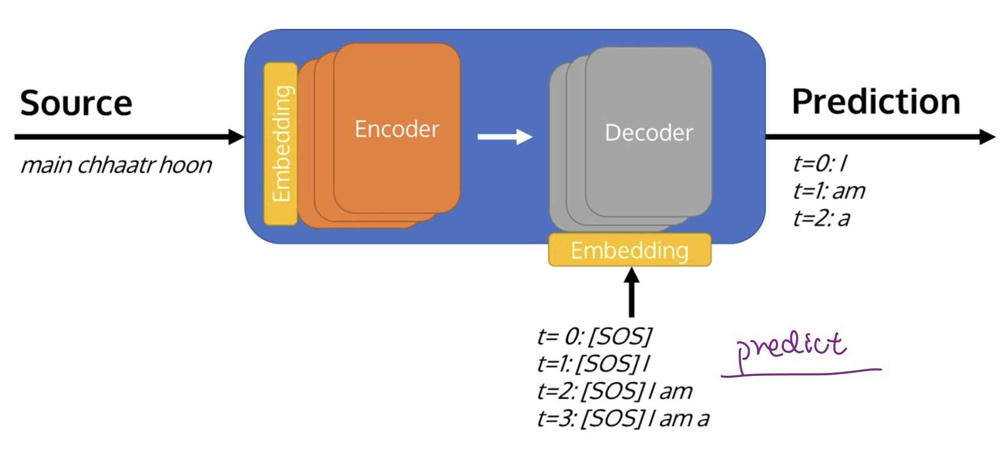

## 起源与发展
两个著名 Transformer 模型：

- GPT (the Generative Pretrained Transformer)；
- BERT (Bidirectional Encoder Representations from Transformers)

通过将 Transformer 结构与无监督学习相结合，我们不再需要对每一个任务都从头开始训练模型

新的 Transformer 模型层出不穷，它们采用不同的预训练目标在不同的数据集上进行训练，但是依然可以按模型结构将它们大致分为三类：

- 纯 Encoder 模型（例如 BERT），又称自编码 (auto-encoding) Transformer 模型；
- 纯 Decoder 模型（例如 GPT），又称自回归 (auto-regressive) Transformer 模型；
- Encoder-Decoder 模型（例如 BART、T5），又称 Seq2Seq (sequence-to-sequence) Transformer 模型

## 什么是 Transformer
Transformer 模型本质上都是预训练语言模型，大都采用自监督学习 (Self-supervised learning) 的方式在大量生语料上进行训练，也就是说，训练这些 Transformer 模型完全不需要人工标注数据

## Transformer的结构

**Input Embedding:** Embedding matrix: $[V, D]$. 

Transformers(编码器只运行一次处理整个输入序列,解码器必须为序列中的每个新token重新运行). 

{ width="400" }

- $V$ (Vocabulary Size)：词汇量大小，即模型能够识别的不同单词或标记（tokens）的数量
- $D$ (Dimensionality)：嵌入维度，表示每个单词或标记被转换成的向量的大小，这个向量能够捕捉并表达单词的语义特征
### Self-Attention
Mechanism that allows each input in a sequence to look at the whole sequence to compute a representation of the sequence.

$$Attention(Q,K,V)=σ(\frac{QK^T}{\sqrt{d_n}})V.$$

- $Q∈R^{S×d_n}$, $K^T∈R^{d_n×S}$
- Attention (weight) matrix: $σ(\frac{(QK^T)}{\sqrt{d_n}})∈R^{S×S}$ contain weights for how relevant each word is to others. 
- Attention output: $σ(\frac{(QK^T)}{\sqrt{d_n}})V∈R^{S×d_h}$. 

$S$：输入序列的长度（即共有多少个词），$D$：输入词嵌入的维度（单头中$d_h=D$）

①将输入序列的每个词向量转换成对应的查询向量，键向量和值向量

{ width="800" }

$$Q=W∙W^Q,Q∈R^{S×d_h},W∈R^{S×D},W^Q∈R^{D×d_h}$$

同理：$K=W∙W^K; V=W∙W^V$ 

② 对于每一个$q_j$，计算其与每一个键向量的相似

$$z_j=∑_{s=1}^S(σ_s×v_s)=∑_{s=1}^S(σ(\frac{q_j k_s}{\sqrt{d_n}} v_s))$$

- Similarity function: $q_j k_s$. 
- $S_{1,i}=\frac{q_1 k_s}{\sqrt{d_n}}$：the un-normalizaed similarity between the give query ($q_1$) and key values
- Softmax(σ)得出概率分布，表达了输入序列中每个词对当前词的重要性程度. 
	- $S'_{1,i}=σ\frac{q_1 k_s}{\sqrt{d_n}}$：the normalizaed similarity between the give query ($q_1$) and key values
- $\sqrt{d_n}$代表键向量的维度：当进行点积运算时,向量的维度越高,点积的结果会越大,会导致σ函数前的指数运算结果非常大,导致梯度消失或者爆炸的问题。因此需要除以$\sqrt{d_n}$
- $z_j=∑_{s=1}^S(σ_s×v_s)=∑_{s=1}^S(σ(\frac{q_j k_s}{\sqrt{d_n}} v_s))$：在考虑整个序列的上下文信息后，序列中的一个词的最终输出

### Multi-head attention 
- performs self-attention head amount of times in parallel.
- use different $W^Q$, $W^K$, $W^V$ for each self-attention heads, each head $d_h=\frac{D}{\#heads}$（D：输入词嵌入的维度）. 

### Normalization

$$x̂=\frac{x-μ}{σ}$$

### Layer Normalization
对于单个样本内的特征,计算这些特征的均值和方差,然后对该样本的所有特征进行归一化. 

{ width="700" }

**Gamma (γ) 和 Beta (β) 使用向量形式而不是标量**：
 - 是用于对每个隐藏层的加权和进行再和位移的参数。我们不能假设$R^{d}$空间中的每个点都有相同的重要性。因此要对每个点分配不同的权重，以允许模型对每个输入特征的规模（scale）和偏移（shift）进行调整

### Residual Connections
{ width="700" }

### Position-wise Feedforward Network: 
Position-wise means it is applying the same transformation to every element in the sequence. 
*i.e. same weights applied to all tokens in the sequence.*

$$FNN(x)=max⁡(0,xW_1+b) W_2+b_2, W_1∈R^{D×d_{ff}}$$

$$W_2∈R^{d_{ff}×D}$$

e.g. $d_{ff}$=2048.

### Positional Encodings
- Transformer处理输入是无序,需要一种方式来利用输入序列中词汇的顺序信息. 
- Transformers are position invariant: inject position information into the embeddings.

e.g., sinusoids

$$PE_(pos,2i)=sin⁡(pos/10000^{2i/d})$$

$$PE_(pos,2i+1)=cos⁡(pos/10000^{2i/d})$$

- $pos$: position of the word in the sequence
- $i$: index of the dimension. 
- input = $Token\_embedding(x)$ + $position\_embedding(s)$. 

### Masked Multi-head Self-attention
Masked MHA is a strategy to tell the model, during training, not to look at future tokens.
use mask matrix，每一行代表一个时间步. 
{ width="700" }

### Teacher forcing
Teacher forcing指模型在预测下一个单词时会被强制使用真实的前一个单词。这可以帮助加速训练并提高模型的稳定性。

- 当Teacher forcing的radio为100时，即强制在训练时始终使用真实的前一个单词
- 当Teacher forcing的radio比较低时，是为了鼓励模型学会更加独立的生成文本。
- Transformers使用Teacher forcing进行训练时, Teacher forcing的radio是可变的. 

### Cross Attention 

- Every time decoding a token, we need to know which encoded words we should look at to decode the token.交叉注意力机制关注编码器的输出,以便融入输入序列的信息. 
- Cross attention matrix：[T target sequence length, S source sequence length], 表示在生成目标语言的每个单词时，每个源语言单词对其的贡献大小. 
- Query comes from the current decoder layer, and  use the key, value tensors from the last encoder layer. 

## Encoder
Embedding + PE layer, followed by a for loop over the encoder layers. 编码器的输出是一个包含了整个输入序列的深层次表示的序列.

{ width="700" }

**工作流程:**

{ width="700" }

## Decoder
使用自回归生成的方法来预测序列(每个时间步都会通过所有解码层,然后预测出一个token. mask确保模型在每一时间步只能访问到该时间步和它之前的token). 

{ width="700" }

- $Training$: ⼀次性地将整个⽬标序列输⼊到解码器中，并使⽤mask来阻⽌解码器查看未来的token。

{ width="700" }

- $Testing$: 每个时间步都会基于之前所有时间步生成的输出来预测下一个输出。每个时间步都会依次通过所有的Decoder layer。

{ width="700" }

**Differences between Encoder and Decoder:**

 - Use the Masked multi-head self-attention
 - Use the Cross attention (use the key and value tansor from the encoder)

**工作流程:**

{ width="700" }