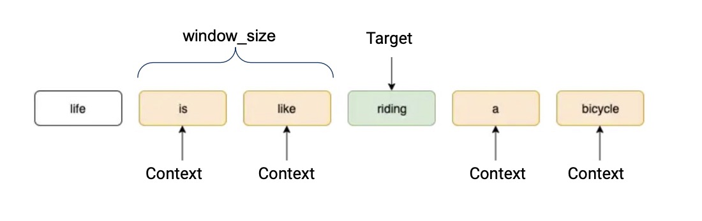
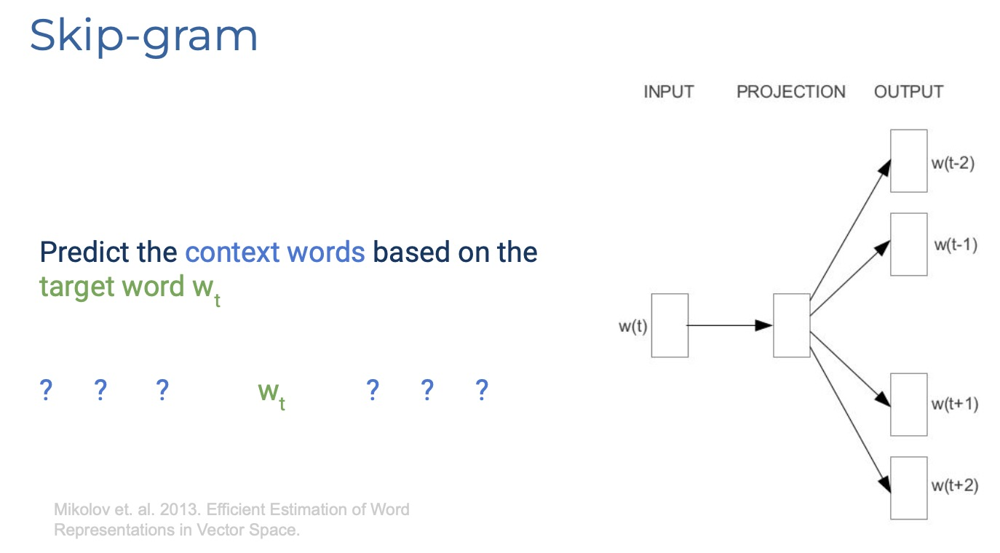
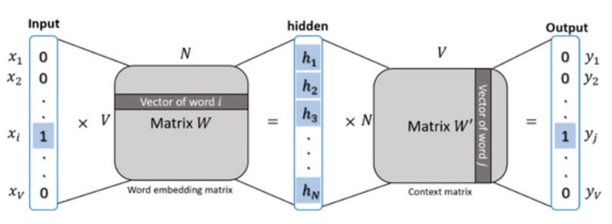
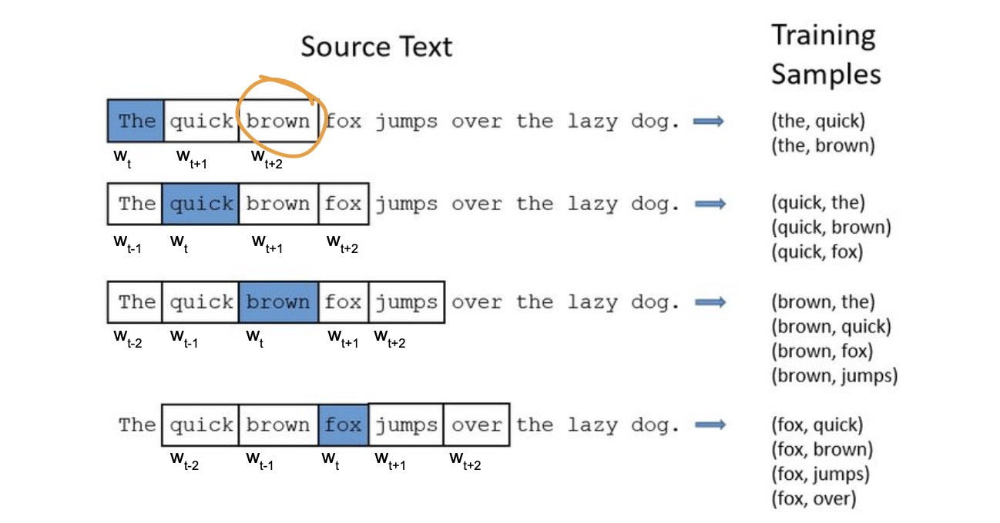
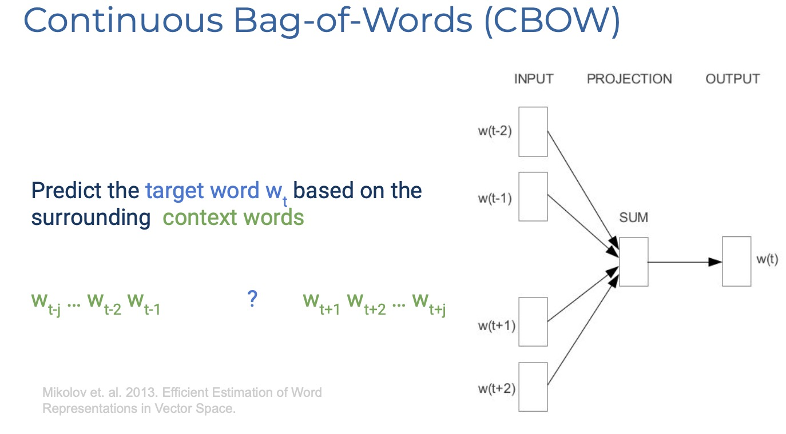

## Word2Vec模型

Word2Vec is a “family” of NN based algorithms to obtain embeddings:

- Architectures: Skip-gram and CBOW
- Training strategy: Negative Sampling and Hierarchical Softmax 

**Representing a sequence**:
{ width="700" }

- A context word is a word that is “window_size” away from a target word. 
- In this example, window_size is 2. That means the context words are the 2 words preceding the target word, and the 2 words proceeding the target word.
- If “like” was our target word, then “life, is, riding, a” would be our context words.

### Skip-gram
feed in target word as input, and the model aims to predict what the context words are.

{ width="700" }

#### Details

{ width="700" }

**notations:**

- $V$: the number of the Vocabulary
- $N$: the deminsion of the embedding

**Process:**

- **Input $X$**: 1-hot vector [1, V]
- **the word (embedding) matrix $W$**: every row/column on the word (embedding) matrix $W'$ representing the context embedding of every word. [V,N]
    - **Target embedding $h$**: $X$ passes the word (embedding) matrix $W$. [1,N]
- **Context (embedding) matrix $'W'$**:
    - $y$: Target embedding $h$ multiply context (embedding) matrix. [1,V]
- **Prediction:** for every target word, we use the $v_{target\_word}$ finding from the Target embedding $h$ of word $v$ to multiply the vectors of other words finding from the results after passing the Context (embedding) matrix $'W'$, then use the $softmax$ to calculate to find the words having the highest prob ($softmax(v_{target\_word}∙v_{context\_word i})$).

**使用滑动窗口技术来创建上下文词：**

e.g.,: window_size($c$) = 2

{ width="700" }

**目标函数：**

- 目标： 对整个训练语料库中的单词序列进行迭代，通过每个词的上下文窗口来最大化上下文词的最大化概率
- 目标函数: $\frac{1}{𝑇}∑^{T}_{t=1}∑_{−𝑐≪𝑗≪𝑐,𝑗≠0}𝑙𝑜𝑔𝑃(𝑤_{𝑡+𝑗}|𝑤_{𝑡};𝜃)$, where $𝑃(𝑤_{𝑡+𝑗}𝑤_{𝑡})$=$\frac{exp(𝑣_{𝑤_{𝑡+𝑗}}𝑣_{𝑤_{𝑡}})}{∑^{𝑊}_{𝑖=1}exp(𝑣_{𝑤_{i}}𝑣_{𝑤_{𝑡}})}$
    - $𝑃(𝑤_{𝑡+𝑗}|𝑤_{𝑡})$:给定当前单词$𝑤_{𝑡}$时，上下文单词$𝑤_{𝑡+𝑗}$出现的概率

### CBOW
feed context words as input to the model, the model is then optimized to predict what the target word actually is.
{ width="700" }

### Negative Sampling

**原因:** 当 vocabularies 和 embeddings 很大时,使用 SoftMax 计算会不方便，计算会很expensive

**函数:** $𝑙𝑜𝑔𝑃(𝐷=1|𝑤_{𝑡},𝑤_{𝑡+1})+𝑘𝔼_{\hat{c}𝑃_{𝑛𝑜𝑖𝑠𝑒}}[𝑙𝑜𝑔𝑃(𝐷=0|𝑤_{𝑡},𝑐)]$,对于每个真实上下文词，随机从整个Vocabulary中抽取$k$个负例进行训练.

**举例:** Use binary classification to distinguish real context words from noise context words

- $𝑃(𝐷=1|𝑤_{𝑡},𝑤_{𝑡+1})$：binary logistic regression probability of seeing the word $$𝑤_{𝑡}$ in the context $$𝑤_{𝑡+1}$
    - $𝑃(𝐷=1|𝑤_{𝑡},𝑤_{𝑡+1})=\frac{1}{1+exp(−𝑣_{𝑡}𝑣_{𝑡+1})}$
    - $𝑃(𝐷=0|𝑤_{𝑡},𝑐)=𝟏−\frac{1}{1+exp(−𝑣_{𝑡}𝑣_{𝑐})}$

=> $𝐿𝑜𝑠𝑠$=$−(𝑙𝑜𝑔𝑃(𝐷=1|𝑤_{𝑡},𝑤_{𝑡+1})+∑^{k}_{i=1}𝑃(𝐷=0|𝑤_{𝑡},𝑐_{i})$

### Hierarchical Softmax